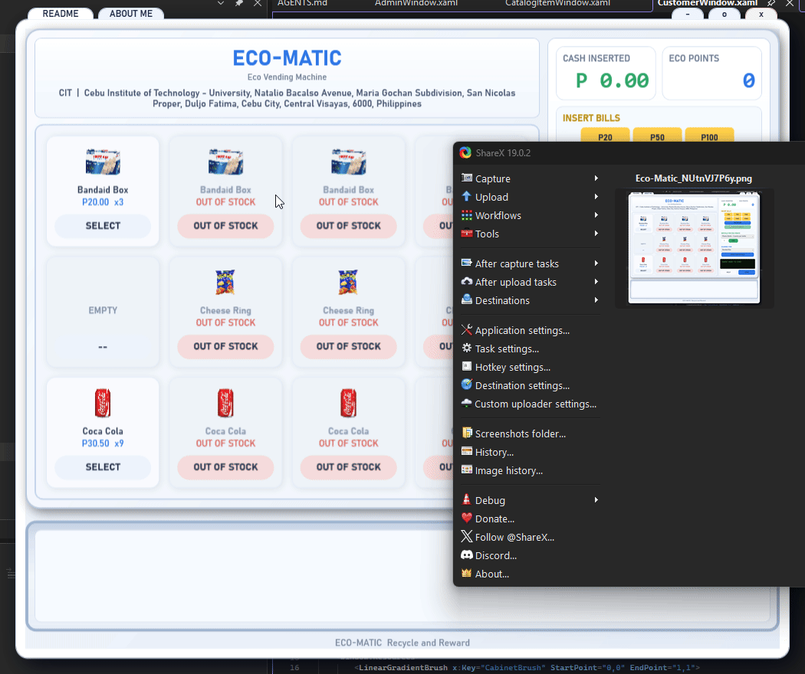
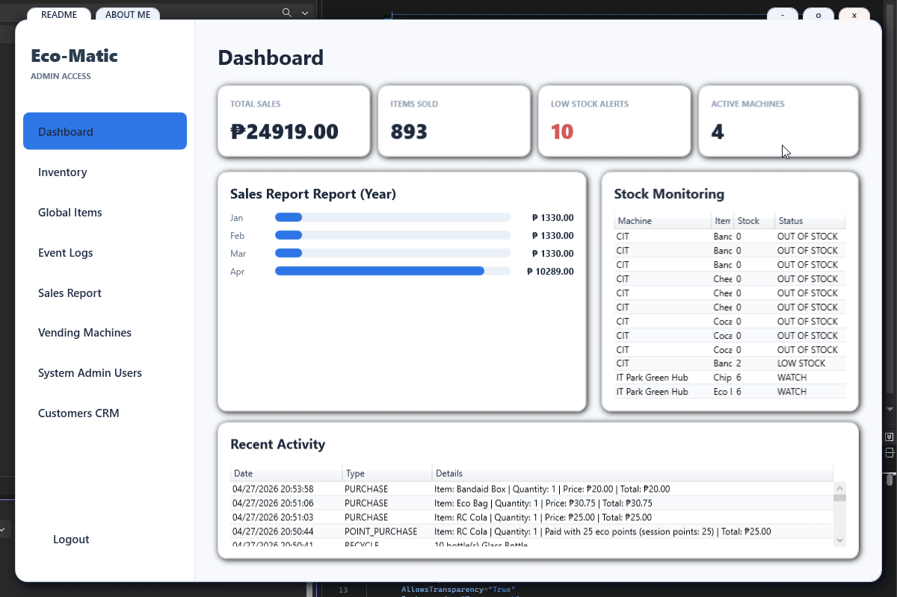
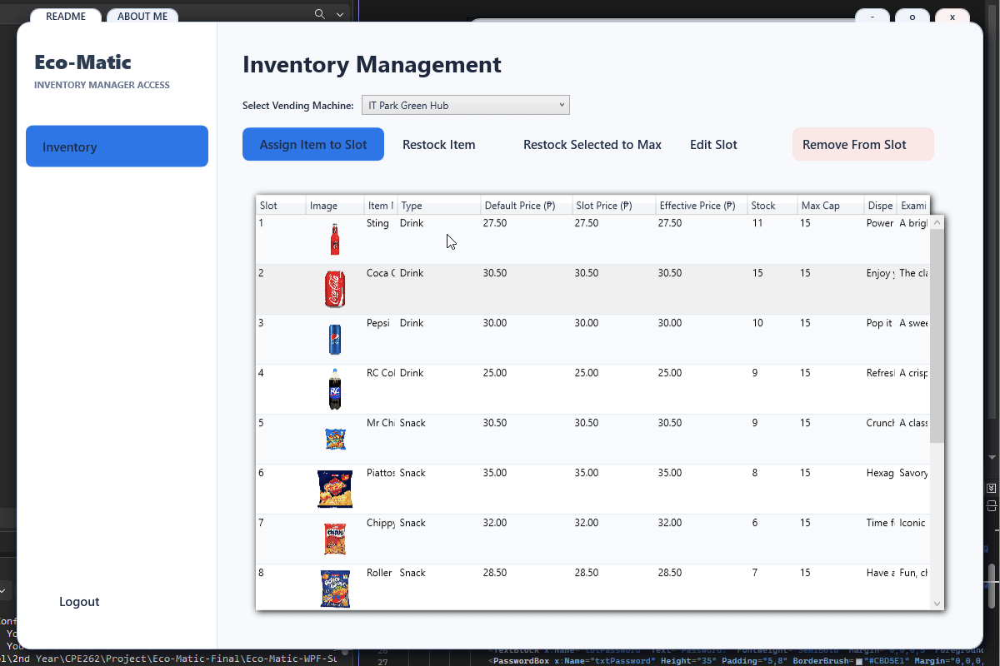

# Eco-Matic Vending and Recycling System

Eco-Matic is a WPF desktop application for a smart vending machine with recycling rewards. It combines a customer vending interface, RFID-linked eco-credit accounts, inventory management, sales reporting, QR payment support, and Arduino hardware feedback in one project.

## Demo Preview

### Customer Vending



### Admin Dashboard



### Inventory Management



## Main Features

- Customer vending screen with a 12-slot machine layout
- Cash and QR-paid balance purchasing flow
- RFID customer registration and eco-credit saving
- Recyclable item tracking for bottle/can credit values
- Admin dashboard for machines, users, sales, logs, and customers
- Global item catalog separated from per-machine inventory slots
- Machine-specific stock, capacity, and optional item price overrides
- Receipt display and receipt printing support
- Arduino serial integration for RFID scans, LCD text, and LED feedback
- Supabase PostgreSQL backend through REST-based data access

## Tech Stack

- .NET 10.0 WPF
- C#
- Supabase PostgreSQL and PostgREST
- Supabase Edge Function for QR payment simulation
- Arduino Uno/Nano with RC522 RFID reader and I2C LCD
- QRCoder, WebView2, System.IO.Ports, and System.Speech

## Project Structure

- `Data/` - Supabase access, session coordination, Arduino communication, QR payment, receipt printing, and environment loading
- `Models/` - vending products, transactions, recyclable item definitions, and receipt data
- `Utilities/` - image loading, slot helpers, audio, and ESC/POS receipt formatting
- `Arduino/` - RFID scanner firmware and hardware setup notes
- `Assets/Images/` - local product images used by the vending UI
- `Assets/Gifs/` - demo recordings used in this README
- `docs/` - architecture notes, diagrams, SQL references, review notes, and user documentation

## Setup

### 1. Configure Environment Variables

Create a repo-root `.env` file by copying `.env.example`.

Required values:

```env
ECOMATIC_SUPABASE_URL=...
ECOMATIC_SUPABASE_ANON_KEY=...
```

Optional hardware settings:

```env
ECOMATIC_ARDUINO_PORT=COM5
ECOMATIC_ARDUINO_BAUD=9600
```

The app stops during startup if `.env` is missing or still contains placeholder Supabase values. If the same variables are also defined in Windows, the Windows environment values take priority.

### 2. Prepare Supabase

SQL setup files are under `docs/sql/`.

For a fresh Supabase project, apply the migrations in numeric order from:

```text
docs/sql/migrations/supabase/
```

Then apply seed data if a starting inventory is needed:

```text
docs/sql/seeds/seed_inventory.sql
```

The current inventory model uses:

- `items` for the shared global catalog
- `machine_inventory` for machine-specific slots, stock, capacity, and optional item price overrides
- soft delete fields on `items` so removed catalog items disappear from active screens while old sales reports keep their history

### 3. Prepare Arduino Hardware

Follow `Arduino/README.md`, then flash:

```text
Arduino/RFID_Scanner/RFID_Scanner.ino
```

The default serial connection is `COM5` at `9600` baud unless overridden in `.env`.

### 4. Build and Run

```bash
dotnet build
dotnet run --project Eco-Matic.csproj
```

The application requires live Supabase connectivity for customer and admin data features.

## Documentation

- `docs/README.md` - documentation index
- `docs/FINAL_PROJECT_DOCUMENTATION.md` - formal final project documentation
- `docs/Eco-Matic-Final-Project-Documentation.docx` - Word version of the final documentation
- `docs/CODEBASE_ARCHITECTURE.md` - architecture overview
- `docs/DIAGRAMS.md` - diagram index
- `docs/CODE_REVIEW.md` - implementation review notes
- `docs/SUPABASE_AUDIT.md` - database audit notes
- `docs/USER_MANUAL.md` - user operation guide

## Current Scope

Eco-Matic is ready as a classroom/demo smart vending system. The current build focuses on Supabase-backed vending, admin management, RFID registration and eco-credit saving, QR payment simulation, sales reporting, and Arduino hardware feedback.
