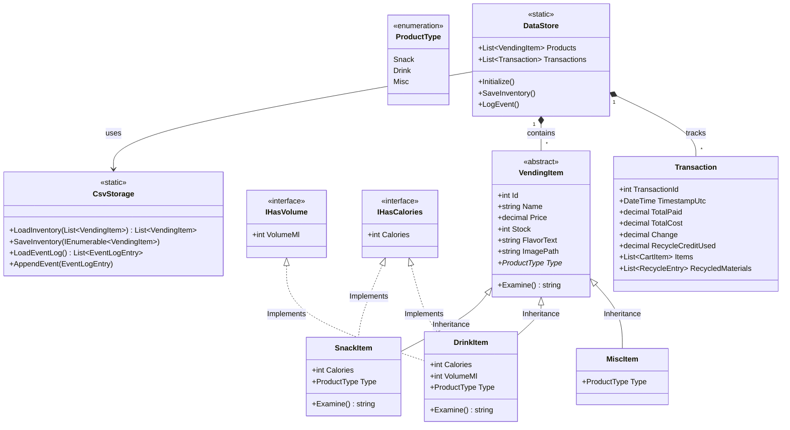

# Eco-Matic Vending Machine: Class Diagram

```mermaid
classDiagram
    class VendingItem {
        <<abstract>>
        +int Id
        +string Name
        +decimal Price
        +int Stock
        +string FlavorText
        +string ImagePath
        +ProductType Type*
        +Examine() string
    }

    class IHasVolume {
        <<interface>>
        +int VolumeMl
    }

    class IHasCalories {
        <<interface>>
        +int Calories
    }

    class SnackItem {
        +int Calories
        +ProductType Type
        +Examine() string
    }

    class DrinkItem {
        +int Calories
        +int VolumeMl
        +ProductType Type
        +Examine() string
    }

    class MiscItem {
        +ProductType Type
    }

    class ProductType {
        <<enumeration>>
        Snack
        Drink
        Misc
    }

    VendingItem <|-- SnackItem : Inheritance
    VendingItem <|-- DrinkItem : Inheritance
    VendingItem <|-- MiscItem : Inheritance
    
    IHasCalories <|.. SnackItem : Implements
    IHasCalories <|.. DrinkItem : Implements
    IHasVolume <|.. DrinkItem : Implements

    class Transaction {
        +int TransactionId
        +DateTime TimestampUtc
        +decimal TotalPaid
        +decimal TotalCost
        +decimal Change
        +decimal RecycleCreditUsed
        +List~CartItem~ Items
        +List~RecycleEntry~ RecycledMaterials
    }

    class CsvStorage {
        <<static>>
        +LoadInventory(List~VendingItem~) List~VendingItem~
        +SaveInventory(IEnumerable~VendingItem~)
        +LoadEventLog() List~EventLogEntry~
        +AppendEvent(EventLogEntry)
    }

    class DataStore {
        <<static>>
        +List~VendingItem~ Products
        +List~Transaction~ Transactions
        +Initialize()
        +SaveInventory()
        +LogEvent()
    }

    DataStore --> CsvStorage : uses
    DataStore "1" *-- "*" VendingItem : contains
    DataStore "1" *-- "*" Transaction : tracks
```
