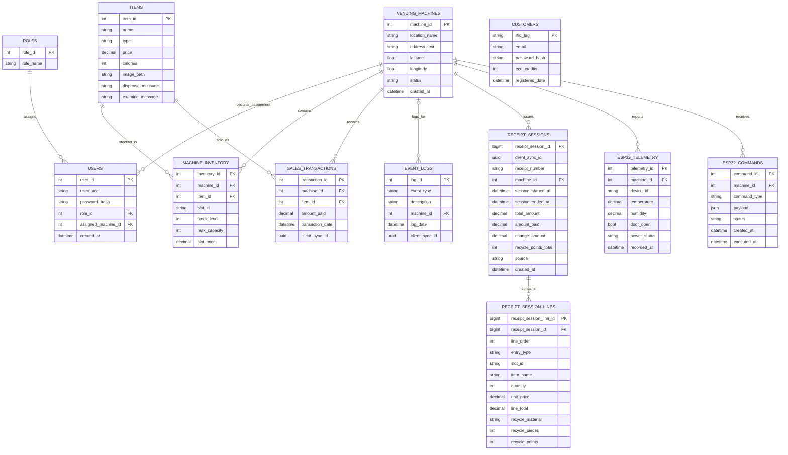
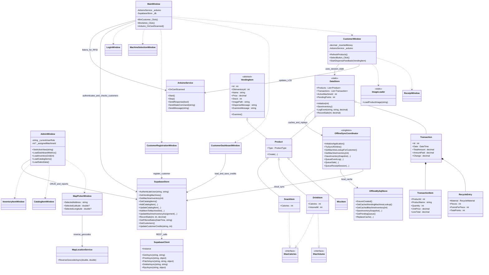
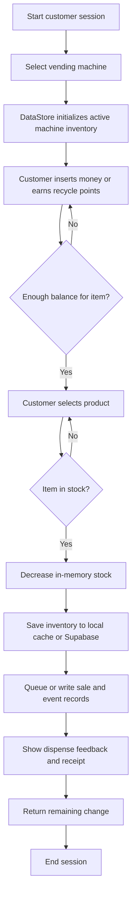

# Eco-Matic Diagrams

This document contains presentation-ready Mermaid diagrams for the current codebase.

## 1. Entity Relationship Diagram (ERD)

## How to Explain the ERD

- `roles` and `users` implement role-based access control.
- `vending_machines` allows the system to scale beyond one physical machine and now stores machine name plus optional physical location data.
- `items` is the master catalog of products.
- `machine_inventory` is the junction table that connects a machine to an item and stores slot, stock, capacity, and optional machine-specific price.
- `sales_transactions` stores every completed sale.
- `event_logs` stores audit-style system activity such as purchases and recycling actions.
- `customers` stores RFID users and eco-credit balances.
- `receipt_sessions` and `receipt_session_lines` store receipt-level history for completed vending sessions.
- `esp32_telemetry` and `esp32_commands` extend the schema for machine-side telemetry and command delivery.

Important clarification:

`customers` is currently not connected by foreign key to `sales_transactions`. In this implementation, the customer RFID workflow is for registration and saving recycle points, while sales are recorded separately.

## 2. Class Diagram

## How to Explain the Class Diagram

- `MainWindow` is the entry controller of the application.
- `AdminWindow` and `CustomerWindow` are the two major use-case windows.
- `DataStore` manages temporary in-memory session state for customer mode.
- `OfflineSyncCoordinator` bridges customer-mode local caching with Supabase replay.
- `SupabaseStore` is the application service that hides backend details from the UI.
- `SupabaseClient` is the low-level HTTP client.
- `ArduinoService` handles event-driven hardware communication.
- `VendingItem` and its subclasses show inheritance and polymorphism.
- `Transaction`, `TransactionItem`, and `RecycleEntry` model what happens during a purchase session.

## 3. Difference Between ERD and Class Diagram

Use this sentence during your defense:

> The ERD explains how persistent data is stored in the database, while the class diagram explains how the software objects collaborate at runtime inside the WPF application.

That distinction is important because not every class becomes a table, and not every table becomes a rich domain object.

## 4. Buying Process Flow

## How to Explain the Buying Process

- `DataStore.Initialize()` loads the selected machine inventory before vending begins.
- `CustomerWindow` manages balance checking and stock validation in the UI.
- `DataStore.SaveInventory()` persists stock changes through the sync layer.
- `DataStore.LogEvent()` and `DataStore.RecordSale()` either write immediately or queue replay work, depending on connectivity.
- `ReceiptWindow` finishes the customer-facing flow.
