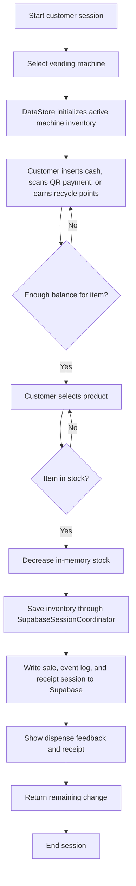

# Customer Buying Process Flowchart

## How to Explain It

- `DataStore.Initialize()` loads the chosen machine inventory.
- `CustomerWindow` handles balance checking, product selection, stock validation, and receipt display.
- `DataStore.SaveInventory()`, `DataStore.RecordSale()`, and `DataStore.SaveCompletedReceipt()` persist the customer action through the Supabase session layer.
- Customer-mode writes go directly to Supabase; there is no local database fallback in the current build.
