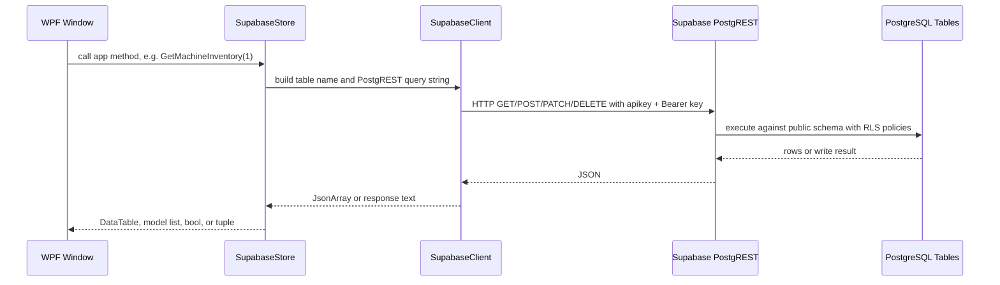

# Database Connection Sequence Diagram

## How to Explain It

- The WPF windows do not directly open PostgreSQL connections.
- `SupabaseStore` exposes project-specific methods such as `GetMachineInventory`, `AddCatalogItem`, `RecordSale`, and `UpdateCustomerCredits`.
- `SupabaseClient` owns the HTTP client and reads `ECOMATIC_SUPABASE_URL` plus the Supabase API key from environment configuration.
- Supabase exposes the PostgreSQL database through PostgREST at `/rest/v1`.
- Normal table work uses HTTP methods: `GET` for reads, `POST` for inserts, `PATCH` for updates, and `DELETE` for deletes.
- QR payment work uses the active `qr-payment-confirm` Edge Function at `/functions/v1/qr-payment-confirm`.

