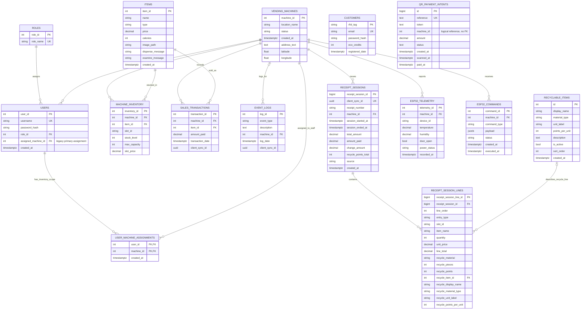

# Entity Relationship Diagram

This ERD reflects the live Supabase public schema verified through the Supabase MCP tool on 2026-04-26.

## How to Explain It

- `items` is the global product catalog.
- `machine_inventory` is the per-machine slot table for stock, capacity, and optional slot price.
- `vending_machines` is the parent for inventory, staff machine assignments, sales, event logs, telemetry, ESP32 commands, and receipt sessions.
- `receipt_sessions` and `receipt_session_lines` store complete receipt history.
- `customers` stores RFID customers and eco-credit balances. It is not currently connected to sales by a foreign key.
- `user_machine_assignments` lets one inventory manager manage multiple assigned vending machines. `users.assigned_machine_id` remains as a legacy primary assignment for compatibility.
- `qr_payment_intents` supports QR payment through the `qr-payment-confirm` Edge Function. Its `machine_id` is a nullable logical reference in the current live schema, not an enforced foreign key.

Use this defense line:

> A product can exist globally once, but stock belongs to a specific vending machine slot, so stock must live in `machine_inventory`, not in `items`.
