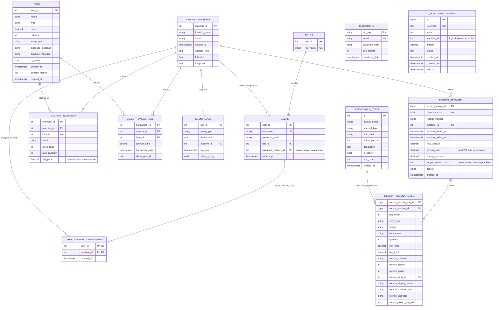

# Entity Relationship Diagram

This ERD reflects the live Supabase public schema verified on 2026-04-30 and rechecked during the final presentation audit. It was updated on 2026-05-01 for the application-level receipt point-accounting update and the `items` soft-delete catalog design in migration increment 10. The 2026-05-14 README hardware GIF update documents customer/AFK Arduino states only and does not add database entities or relationships.

## How to Explain It

- `items` is the global product catalog.
- `machine_inventory` is the per-machine slot table for stock, capacity, and optional machine item price override.
- Catalog deletion clears matching `machine_inventory` rows, then soft-deletes the `items` row by setting `is_active = false`, `deleted_at`, and `deleted_reason`. This keeps `sales_transactions` historical joins intact.
- `vending_machines` is the parent for inventory, staff machine assignments, sales, event logs, and receipt sessions.
- `receipt_sessions` and `receipt_session_lines` store complete receipt history.
- Receipt point usage is currently reflected in the application `Transaction` object, receipt screen, printed receipt, and purchase event logs. The live `receipt_sessions` table still stores cash/QR paid amount and recycle points earned, but it does not yet have dedicated persisted columns for points spent or final RFID balance.
- `customers` stores RFID customers and eco-credit balances. It is not currently connected to sales or event logs by a foreign key.
- Customer account transaction history is implemented at the application layer by reading purchase-related `event_logs.description` entries that include the RFID tag.
- Current-session purchase history can be attached to the first RFID scanned for that vending session, but this is still application-layer event-log behavior rather than a database foreign key.
- `user_machine_assignments` lets one inventory manager manage multiple assigned vending machines. `users.assigned_machine_id` remains as a legacy primary assignment for compatibility.
- `qr_payment_intents` supports QR payment through the `qr-payment-confirm` Edge Function. Its `machine_id` is a nullable logical reference in the current live schema, not an enforced foreign key.
- The 2026-05-01 foreground warning dialog and receipt point-usage fixes are application/UI changes and do not add database relationships shown here.
- The 2026-05-14 customer hardware view and AFK mode GIF additions are documentation/media updates for serial-driven hardware states, so the ERD remains unchanged.
- The `add_missing_foreign_key_indexes` migration adds indexes to existing foreign-key columns only. It improves lookup/delete performance but does not add entities or relationships to the ERD.

Use this defense line:

> A product can exist globally once, but stock belongs to a specific vending machine slot, so stock must live in `machine_inventory`, not in `items`.
