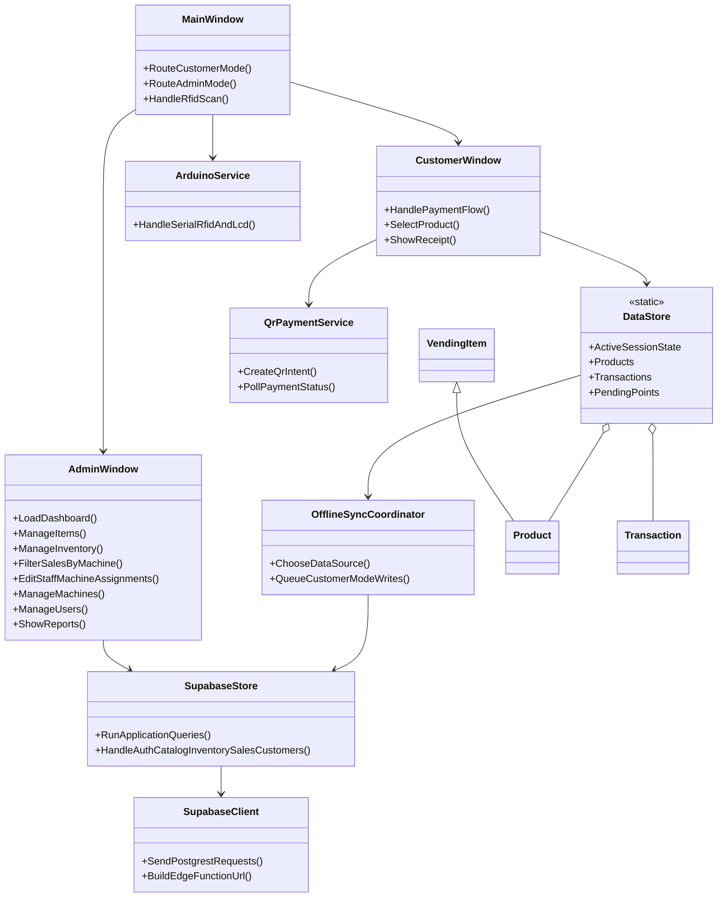

# Short Foundational Class Diagram

Use this diagram during a presentation when the full class diagram is too dense.

## How to Explain It

- `MainWindow` is the entry point and mode router.
- `CustomerWindow` is the customer vending workflow.
- `AdminWindow` is the management console for admins and inventory-only shell for assigned inventory managers.
- `DataStore` keeps active customer-session state in memory.
- `OfflineSyncCoordinator` decides whether customer mode uses Supabase or local cached data.
- `SupabaseStore` is the main app-level database service.
- `SupabaseClient` is the low-level HTTP/PostgREST wrapper.
- `ArduinoService` isolates serial RFID/LCD communication.
- `QrPaymentService` talks to the Supabase Edge Function for QR payment intents.
- `Product` and `Transaction` are the main runtime domain models for vending and receipts.
