# Full Class Diagram

This diagram includes all top-level C# classes, interfaces, enums, records, and important private helper types found in the current codebase.

```mermaid
classDiagram
    class App

    class MainWindow {
        -ArduinoService _arduino
        -SupabaseStore _db
        +BtnCustomer_Click()
        +BtnAdmin_Click()
        +Arduino_OnCardScanned()
    }

    class AdminWindow {
        -SupabaseStore _store
        -string _currentUserRole
        -int? _assignedMachineId
        +LoadDashboardMetrics()
        +LoadInventoryGrid(int)
        +LoadCatalogItems()
        +LoadSalesData()
    }

    class AdminWindow_ChartDatum {
        +string Label
        +string ValueText
        +double BarWidth
        +decimal Value
        +Brush Fill
    }

    class CustomerWindow {
        -decimal _insertedMoney
        -ArduinoService _arduino
        +MarkPendingPointsSaved(int)
        +SetLinkedRfidCustomer(string, string, int)
    }

    class CustomerWindow_SlotControls
    class CustomerWindow_VendingItemOption {
        +int CatalogItemId
        +string Name
    }

    class LoginWindow {
        +string Username
        +string Password
    }

    class MachineSelectionWindow {
        +int SelectedMachineId
        +string SelectedMachineDisplayName
        +string SelectedMachineAddress
    }

    class VendingMachineModel {
        +int MachineId
        +string MachineName
        +string Address
    }

    class CustomerRegistrationWindow
    class CustomerDashboardWindow {
        +int SavedPoints
        +int FinalBalance
        +string CustomerEmail
        +bool SaveSucceeded
    }

    class AddMachineWindow {
        +string LocationName
        +string Address
        +double? Latitude
        +double? Longitude
    }

    class EditMachineWindow {
        +string LocationName
        +string Address
        +string Status
        +double? Latitude
        +double? Longitude
    }

    class MapPickerWindow {
        +string SelectedAddress
        +double? SelectedLatitude
        +double? SelectedLongitude
    }

    class InventoryItemWindow {
        +string SlotId
        +int InitialStock
        +int MaxCapacity
        +decimal? SlotPriceOverride
        +int? SelectedItemId
    }

    class CatalogItemWindow {
        +string ItemName
        +string ItemType
        +string ImagePath
        +decimal Price
        +int Calories
        +string DispenseMessage
        +string ExamineMessage
    }

    class RecyclableItemWindow {
        +string DisplayNameValue
        +string MaterialType
        +string UnitLabel
        +int PointsPerUnit
        +int SortOrder
        +string DescriptionValue
        +bool IsActiveValue
    }

    class RestockWindow {
        +int RestockQuantity
    }

    class UserEditorWindow {
        +string Username
        +string Password
        +int RoleId
        +int? AssignedMachineId
    }

    class PointAmountWindow {
        +int PointAmount
    }

    class QrPaymentWindow {
        +decimal PaidAmount
    }

    class AboutWindow
    class ReadmeWindow
    class ItemDetailsWindow
    class EventLogWindow
    class ReceiptWindow

    class DataStore {
        <<static>>
        +List~Product~ Products
        +List~RecyclableItemDefinition~ RecyclableItems
        +List~Transaction~ Transactions
        +int ActiveMachineId
        +string ActiveMachineDisplayName
        +string ActiveMachineAddress
        +int PendingPoints
        +bool Initialize(int)
        +SaveInventory()
        +RecordSale(int, decimal)
        +SaveCompletedReceipt(Transaction)
    }

    class SupabaseStore {
        +CanConnect()
        +AuthenticateUser(string, string)
        +AuthenticateUserAccess(string, string)
        +GetVendingMachines()
        +GetMachineInventory(int)
        +GetCatalogItems()
        +AddCatalogItem(...)
        +UpdateCatalogItem(...)
        +AddItemToMachineSlot(...)
        +UpdateMachineInventoryAssignment(...)
        +RecordSale(int, int, decimal)
        +GetFilteredSales(DateTime, string, int?)
        +GetInventoryManagerRoleId()
        +UpdateUserMachineAssignments(int, IEnumerable~int~)
        +InsertQueuedReceiptSession(Transaction)
        +CustomerExists(string)
        +RegisterCustomer(string, string, string)
        +UpdateCustomerCredits(string, int)
    }

    class SupabaseStore_MachineSlotRecord {
        +int InventoryId
        +string RawSlotId
        +string? NormalizedSlotId
    }

    class SupabaseClient {
        +Instance
        +GetFunctionUrl(string)
        +GetAsync(string, string)
        +PostAsync(string, object)
        +PatchAsync(string, string, object)
        +DeleteAsync(string, string)
        +RpcAsync(string, object)
        +CountAsync(string, string)
        +CanConnectAsync()
    }

    class OfflineSyncCoordinator {
        +Instance
        +SessionDataSource CurrentSource
        +InitializeApplication()
        +CanEnterCustomerMode()
        +PrepareCustomerModeAsync()
        +GetMachineLookupForCustomer()
        +GetMachineInventory(int)
        +SaveInventorySnapshot(int, IEnumerable~Product~)
        +QueueEventLog(...)
        +QueueSale(...)
        +QueueReceiptSession(Transaction)
    }

    class OfflineMySqlStore {
        +EnsureCreated()
        +GetMetadata()
        +GetCachedVendingMachinesLookup()
        +GetCachedMachineInventory(int)
        +ReplaceCache(...)
        +SaveInventorySnapshot(...)
        +EnqueueEventLog(...)
        +EnqueueSale(...)
        +SaveReceiptSession(...)
        +GetPendingQueue()
        +GetDirtyInventory()
    }

    class SessionDataSource {
        <<enum>>
    }

    class OfflineSyncMetadata
    class PendingSyncQueueItem
    class DirtyInventoryRecord
    class OfflineReceiptSessionRecord
    class OfflineReceiptSessionLineRecord
    class OfflineStoreSettings

    class ArduinoService {
        +Start()
        +Stop()
        +SendResponse(bool)
        +SendStateCommand(string)
        +SendCustomerSessionActive()
        +SendCustomerSessionAfk()
        +SendMessage(string)
    }

    class AppEnvironment {
        <<static>>
        +LoadedDotEnvPath
    }

    class AppConfigurationException
    class CsvStorage

    class MapLocationService {
        +Instance
        +ReverseGeocodeAsync(double, double)
    }

    class MapLocationResult {
        +double Latitude
        +double Longitude
        +string Address
    }

    class QrPaymentService {
        +Instance
        +CreateIntentAsync(int, decimal)
        +GetStatusAsync(string, string)
        +MarkPaidAsync(string, string, decimal)
    }

    class QrPaymentIntent {
        <<record>>
        +string Reference
        +string Token
        +string ConfirmUrl
    }

    class QrPaymentStatus {
        <<record>>
        +string Reference
        +string Status
        +decimal Amount
    }

    class ReceiptPrinterService {
        +Instance
        +TryPrintReceipt(Transaction)
    }

    class ReceiptPrintResult {
        +bool Success
        +string Message
        +string? PortName
    }

    class ReceiptPrinterService_PrinterSettings
    class ReceiptPrinterService_PrinterConnectionMode {
        <<enum>>
    }
    class ReceiptPrinterService_RawPrinterHelper
    class ReceiptPrinterService_DocInfo1

    class EscPosReceiptFormatter {
        <<static>>
    }

    class EscPosReceiptFormatter_ReceiptProfile
    class ImageLoader {
        <<static>>
    }
    class ImagePathConverter
    class SlotIdHelper {
        <<static>>
    }

    class VendingItem {
        <<abstract>>
        +int Id
        +int DbInventoryId
        +int CatalogItemId
        +string Name
        +decimal Price
        +int Stock
        +string ImagePath
        +string DispenseMessage
        +string ExamineMessage
        +Examine()
    }

    class Product {
        +ProductType Type
        +Create(...)
    }

    class SnackItem {
        +int Calories
    }

    class DrinkItem {
        +int Calories
        +int VolumeMl
    }

    class MiscItem
    class IHasCalories {
        <<interface>>
    }
    class IHasVolume {
        <<interface>>
    }
    class ProductType {
        <<enum>>
    }

    class RecyclableItemDefinition {
        +int Id
        +string DisplayName
        +string MaterialType
        +string UnitLabel
        +int PointsPerUnit
        +bool IsActive
        +int SortOrder
    }

    class Transaction {
        +int Id
        +string ClientSyncId
        +string ReceiptNumber
        +int MachineId
        +string MachineDisplayName
        +List~TransactionItem~ Items
        +List~RecycleEntry~ RecycledItems
        +decimal TotalAmount
        +decimal AmountPaid
        +decimal Change
        +int RecyclePointsTotal
    }

    class TransactionItem {
        +int ProductId
        +string SlotId
        +string ProductName
        +int Quantity
        +decimal UnitPrice
        +decimal LineTotal
    }

    class RecycleEntry {
        +int RecyclableItemId
        +string DisplayName
        +string MaterialType
        +int Pieces
        +int PointsPerUnit
        +int TotalPoints
    }

    class EventLogEntry {
        +DateTime TimestampUtc
        +string EventType
        +string Details
        +decimal Amount
    }

    App --> MainWindow
    MainWindow --> ArduinoService : RFID events
    MainWindow --> SupabaseStore : RFID/customer checks
    MainWindow ..> LoginWindow
    MainWindow ..> MachineSelectionWindow
    MainWindow ..> CustomerRegistrationWindow
    MainWindow ..> CustomerDashboardWindow
    MainWindow ..> CustomerWindow

    AdminWindow --> SupabaseStore : admin CRUD and reports
    AdminWindow o-- AdminWindow_ChartDatum
    AdminWindow ..> AddMachineWindow
    AdminWindow ..> EditMachineWindow
    AdminWindow ..> MapPickerWindow
    AdminWindow ..> InventoryItemWindow
    AdminWindow ..> CatalogItemWindow
    AdminWindow ..> RecyclableItemWindow
    AdminWindow ..> RestockWindow
    AdminWindow ..> UserEditorWindow
    AdminWindow ..> EventLogWindow

    CustomerWindow --> DataStore : active session state
    CustomerWindow --> ArduinoService : LCD/status
    CustomerWindow --> QrPaymentService : QR payment
    CustomerWindow ..> PointAmountWindow
    CustomerWindow ..> QrPaymentWindow
    CustomerWindow ..> ItemDetailsWindow
    CustomerWindow ..> ReceiptWindow
    CustomerWindow o-- CustomerWindow_SlotControls
    CustomerWindow o-- CustomerWindow_VendingItemOption

    MachineSelectionWindow o-- VendingMachineModel
    AddMachineWindow ..> MapPickerWindow
    EditMachineWindow ..> MapPickerWindow
    MapPickerWindow --> MapLocationService
    MapLocationService --> MapLocationResult

    DataStore --> OfflineSyncCoordinator
    DataStore o-- Product
    DataStore o-- RecyclableItemDefinition
    DataStore o-- Transaction
    OfflineSyncCoordinator --> SupabaseStore
    OfflineSyncCoordinator --> OfflineMySqlStore
    OfflineSyncCoordinator --> SessionDataSource
    OfflineMySqlStore --> OfflineSyncMetadata
    OfflineMySqlStore --> PendingSyncQueueItem
    OfflineMySqlStore --> DirtyInventoryRecord
    OfflineMySqlStore --> OfflineReceiptSessionRecord
    OfflineMySqlStore --> OfflineReceiptSessionLineRecord
    OfflineMySqlStore --> OfflineStoreSettings

    SupabaseStore --> SupabaseClient
    SupabaseStore o-- SupabaseStore_MachineSlotRecord
    SupabaseStore ..> RecyclableItemDefinition
    SupabaseStore ..> Transaction
    SupabaseClient --> AppEnvironment
    AppConfigurationException --|> InvalidOperationException

    QrPaymentService --> SupabaseClient
    QrPaymentService --> QrPaymentIntent
    QrPaymentService --> QrPaymentStatus
    ReceiptWindow --> ReceiptPrinterService
    ReceiptPrinterService --> ReceiptPrintResult
    ReceiptPrinterService --> EscPosReceiptFormatter
    ReceiptPrinterService o-- ReceiptPrinterService_PrinterSettings
    ReceiptPrinterService o-- ReceiptPrinterService_PrinterConnectionMode
    ReceiptPrinterService o-- ReceiptPrinterService_RawPrinterHelper
    ReceiptPrinterService_RawPrinterHelper o-- ReceiptPrinterService_DocInfo1
    EscPosReceiptFormatter o-- EscPosReceiptFormatter_ReceiptProfile

    ImagePathConverter --> ImageLoader
    InventoryItemWindow --> SlotIdHelper
    SupabaseStore --> SlotIdHelper
    DataStore --> SlotIdHelper

    VendingItem <|-- Product
    Product <|-- SnackItem
    Product <|-- DrinkItem
    Product <|-- MiscItem
    SnackItem ..|> IHasCalories
    DrinkItem ..|> IHasCalories
    DrinkItem ..|> IHasVolume
    Product --> ProductType

    Transaction *-- TransactionItem
    Transaction *-- RecycleEntry
```

## How to Explain It

- The WPF window classes handle user interaction and routing.
- `DataStore`, `OfflineSyncCoordinator`, `SupabaseStore`, and `SupabaseClient` form the main data path.
- `AdminWindow` can scope sales reports to all machines or one selected vending machine.
- `ArduinoService`, `QrPaymentService`, and `ReceiptPrinterService` isolate hardware/payment/printing concerns.
- `VendingItem`, `Product`, `Transaction`, `TransactionItem`, and `RecycleEntry` are the key runtime domain models.
