# Full Grouped Class Diagram

This grouped diagram shows the current Supabase-only WPF architecture. It keeps the important concrete classes, helper services, and domain models while grouping them by responsibility so the diagram is easier to defend than a flat class list.

```mermaid
classDiagram
    namespace UI_Windows {
        class App {
            +OnStartup()
        }

        class MainWindow {
            -ArduinoService _arduino
            -SupabaseStore _db
            +BtnCustomer_Click()
            +BtnAdmin_Click()
            +Arduino_OnCardScanned()
            +RefreshConnectivityBadgeAsync()
        }

        class AdminWindow {
            -string _currentUserRole
            -HashSet~int~ _assignedMachineIds
            +LoadDashboardMetrics()
            +LoadInventoryGrid()
            +LoadCatalogItems()
            +LoadSalesData()
            +UpdateSalesReportVisuals()
            +CatalogItemNameExists()
        }

        class CustomerWindow {
            -decimal _insertedMoney
            -int _pendingPoints
            -int _availableEcoCredits
            -int _totalPointsSpent
            +SelectButton_Click()
            +BtnRecycle_Click()
            +BtnPayWithPoints_Click()
            +MarkPendingPointsSaved()
            +SetLinkedRfidCustomer()
        }

        class LoginWindow {
            +Username
            +Password
        }

        class MachineSelectionWindow {
            +SelectedMachineId
            +SelectedMachineDisplayName
            +SelectedMachineAddress
        }

        class CustomerRegistrationWindow

        class CustomerDashboardWindow {
            +SavedPoints
            +FinalBalance
            +CustomerEmail
            +SaveSucceeded
        }

        class ReceiptWindow {
            +PopulateReceipt()
            +BtnPrint_Click()
        }

        class AddMachineWindow {
            +LocationName
            +Address
            +Latitude
            +Longitude
        }

        class EditMachineWindow {
            +LocationName
            +Address
            +Status
        }

        class MapPickerWindow {
            +SelectedAddress
            +SelectedLatitude
            +SelectedLongitude
        }

        class InventoryItemWindow {
            +SlotId
            +InitialStock
            +MaxCapacity
            +SelectedItemId
        }

        class CatalogItemWindow {
            +ItemName
            +ItemType
            +Price
            +ImagePath
        }

        class RecyclableItemWindow {
            +DisplayNameValue
            +MaterialType
            +PointsPerUnit
            +IsActiveValue
        }

        class RestockWindow {
            +RestockQuantity
        }

        class UserEditorWindow {
            +Username
            +Password
            +RoleId
            +AssignedMachineIds
        }

        class QrPaymentWindow {
            +PaidAmount
        }

        class PointAmountWindow {
            +PointAmount
        }

        class ItemDetailsWindow
        class EventLogWindow
        class AboutWindow
        class ReadmeWindow
        class VendingMachineModel
    }

    namespace Models {
        class VendingItem {
            <<abstract>>
            +int Id
            +int DbInventoryId
            +int CatalogItemId
            +string Name
            +decimal Price
            +int Stock
            +Examine()
        }

        class Product {
            +ProductType Type
            +Create()
        }

        class SnackItem {
            +int Calories
        }

        class DrinkItem {
            +int Calories
            +int VolumeMl
        }

        class MiscItem

        class IHasCalories {
            <<interface>>
        }

        class IHasVolume {
            <<interface>>
        }

        class ProductType {
            <<enum>>
        }

        class RecyclableItemDefinition {
            +int Id
            +string DisplayName
            +string MaterialType
            +string UnitLabel
            +int PointsPerUnit
            +bool IsActive
        }

        class Transaction {
            +string ReceiptNumber
            +int MachineId
            +List~TransactionItem~ Items
            +List~RecycleEntry~ RecycledItems
            +decimal TotalAmount
            +decimal AmountPaid
            +decimal Change
            +int EcoPointsSpent
            +int SessionPointsSpent
            +int SavedEcoCreditsSpent
            +int RecyclePointsTotal
        }

        class TransactionItem {
            +string SlotId
            +string ProductName
            +int Quantity
            +decimal UnitPrice
            +decimal CashPaid
            +int PointsSpent
        }

        class RecycleEntry {
            +string DisplayName
            +string MaterialType
            +int Pieces
            +int PointsPerUnit
            +int TotalPoints
        }

        class EventLogEntry {
            +DateTime TimestampUtc
            +string EventType
            +string Details
        }
    }

    namespace Services_And_Utilities {
        class ArduinoService {
            +event OnCardScanned
            +Start()
            +Stop()
            +SendStateCommand()
            +SendCustomerSessionActive()
            +SendCustomerSessionAfk()
            +SendMessage()
            +SendResponse()
        }

        class QrPaymentService {
            +CreateIntentAsync()
            +GetStatusAsync()
            +MarkPaidAsync()
        }

        class QrPaymentIntent {
            <<record>>
            +Reference
            +Token
            +ConfirmUrl
        }

        class QrPaymentStatus {
            <<record>>
            +Reference
            +Status
            +Amount
        }

        class ReceiptPrinterService {
            +Instance
            +TryPrintReceipt()
        }

        class ReceiptPrintResult {
            +bool Success
            +string Message
            +string? PortName
        }

        class EscPosReceiptFormatter {
            <<static>>
            +BuildReceipt()
            +BuildReceiptText()
        }

        class AudioService {
            <<static>>
            +PlaySfx()
            +SpeakAsync()
            +StopAllAudio()
        }

        class ImageLoader {
            <<static>>
            +LoadProductImage()
        }

        class ImagePathConverter

        class SlotIdHelper {
            <<static>>
            +Normalize()
            +TryGetSlotNumber()
        }

        class WindowDialog {
            <<static>>
            +Show()
        }
    }

    namespace Supabase_Infrastructure {
        class AppEnvironment {
            <<static>>
            +Initialize()
            +GetRequired()
            +GetOptional()
        }

        class DataStore {
            <<static>>
            +List~Product~ Products
            +List~Transaction~ Transactions
            +int PendingPoints
            +Initialize()
            +SaveInventory()
            +LogEvent()
            +RecordSale()
            +SaveCompletedReceipt()
        }

        class SupabaseSessionCoordinator {
            +bool IsSupabaseAvailable
            +InitializeApplication()
            +PrepareCustomerModeAsync()
            +GetMachineLookupForCustomer()
            +GetMachineInventory()
            +SaveReceiptSession()
        }

        class SupabaseStore {
            +CanConnect()
            +AuthenticateUserAccess()
            +AuthenticateCustomer()
            +GetVendingMachinesLookup()
            +GetMachineInventory()
            +GetCatalogItems()
            +AddCatalogItem()
            +UpdateCatalogItem()
            +DeleteCatalogItem()
            +AddItemToMachineSlot()
            +UpdateCustomerCredits()
            +RecordSale()
            +InsertQueuedReceiptSession()
        }

        class SupabaseClient {
            +Instance
            +CanConnectAsync()
            +GetAsync()
            +PostAsync()
            +PatchAsync()
            +DeleteAsync()
            +BuildFunctionUrl()
        }

        class MapLocationService {
            +ReverseGeocodeAsync()
        }
    }

    App --> MainWindow

    MainWindow --> ArduinoService : RFID events
    MainWindow --> SupabaseStore : auth/customer lookup
    MainWindow --> MachineSelectionWindow
    MainWindow --> CustomerWindow
    MainWindow --> AdminWindow
    MainWindow --> CustomerRegistrationWindow
    MainWindow --> CustomerDashboardWindow

    AdminWindow --> SupabaseStore : admin CRUD and reports
    AdminWindow ..> LoginWindow
    AdminWindow ..> AddMachineWindow
    AdminWindow ..> EditMachineWindow
    AdminWindow ..> MapPickerWindow
    AdminWindow ..> InventoryItemWindow
    AdminWindow ..> CatalogItemWindow
    AdminWindow ..> RecyclableItemWindow
    AdminWindow ..> RestockWindow
    AdminWindow ..> UserEditorWindow
    AdminWindow ..> PointAmountWindow
    AdminWindow ..> WindowDialog : foreground messages

    CustomerWindow --> DataStore : active session state
    CustomerWindow --> ArduinoService : LCD/status
    CustomerWindow --> QrPaymentService : QR payment
    CustomerWindow --> ReceiptWindow : receipt display
    CustomerWindow --> Transaction : creates receipt
    CustomerWindow --> Product : displays slots
    CustomerWindow --> RecyclableItemDefinition : recycle catalog
    CustomerWindow ..> ImageLoader

    ReceiptWindow --> ReceiptPrinterService
    ReceiptPrinterService --> ReceiptPrintResult
    ReceiptPrinterService --> EscPosReceiptFormatter
    QrPaymentService --> QrPaymentIntent
    QrPaymentService --> QrPaymentStatus

    DataStore --> SupabaseSessionCoordinator : Supabase-only session data
    SupabaseSessionCoordinator --> SupabaseStore
    SupabaseStore --> SupabaseClient
    SupabaseClient --> AppEnvironment
    MapPickerWindow --> MapLocationService
    InventoryItemWindow --> SlotIdHelper
    SupabaseStore --> SlotIdHelper

    VendingItem <|-- Product
    Product <|-- SnackItem
    Product <|-- DrinkItem
    Product <|-- MiscItem
    SnackItem ..|> IHasCalories
    DrinkItem ..|> IHasCalories
    DrinkItem ..|> IHasVolume
    Product --> ProductType
    Transaction *-- TransactionItem
    Transaction *-- RecycleEntry
```

## How to Explain It

- `UI_Windows` contains the WPF screens and modal dialogs.
- `Models` contains vending products, recyclable definitions, receipt/session models, and event-log models.
- `Services_And_Utilities` isolates hardware, QR payment, receipt printing, audio, images, slot parsing, and owned message dialogs.
- `ArduinoService` drives the README hardware-demo states: active customer mode sends `STATE:ACTIVE`, while returning to the main screen sends `STATE:AFK`.
- `Supabase_Infrastructure` is now the only data path. `DataStore` keeps temporary customer-session state, while `SupabaseSessionCoordinator`, `SupabaseStore`, and `SupabaseClient` send all persistence to Supabase.
- The old local database fallback classes were removed from the runtime architecture.
- `SupabaseStore.DeleteCatalogItem()` owns history-safe catalog removal: it clears machine slot assignments, then soft-deletes the `items` row so sales reports continue to resolve product labels.
