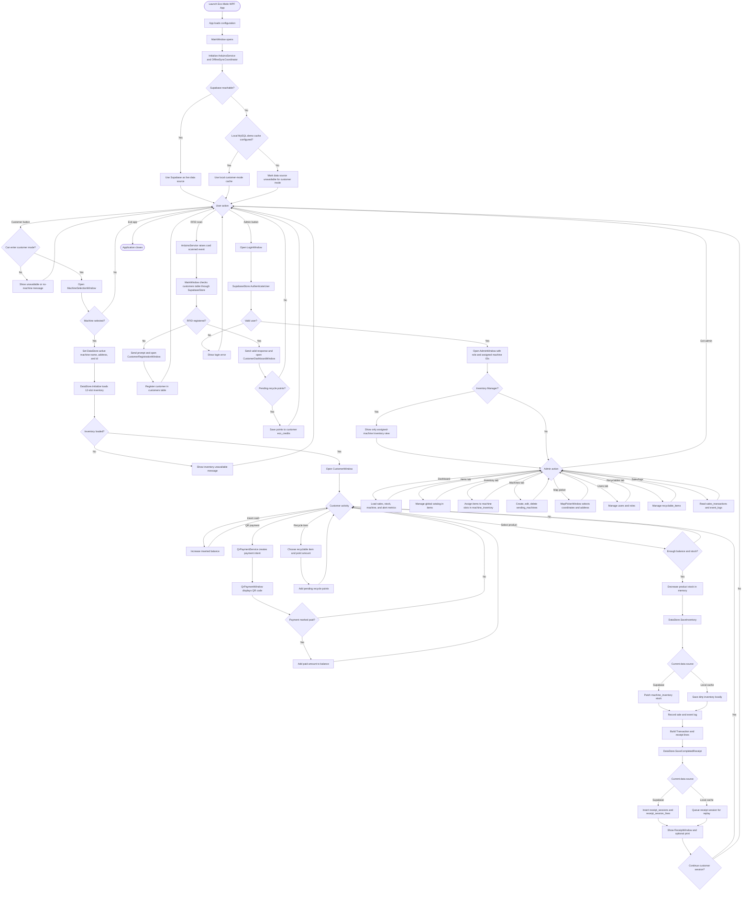

# Entire Program Flowchart

This flowchart shows the whole application from startup through customer mode, admin mode, RFID handling, QR payment, receipts, and persistence.

## How to Explain It

- Startup decides which data source is available.
- Customer mode uses `MachineSelectionWindow`, `DataStore`, `CustomerWindow`, and the sync layer.
- Admin mode uses `LoginWindow`, `AdminWindow`, and `SupabaseStore`.
- RFID scans can interrupt from the main screen and route into registration or dashboard.
- QR payment uses `QrPaymentService` and the Supabase Edge Function.
- Completed sales update inventory, event logs, sales history, and receipt history.
