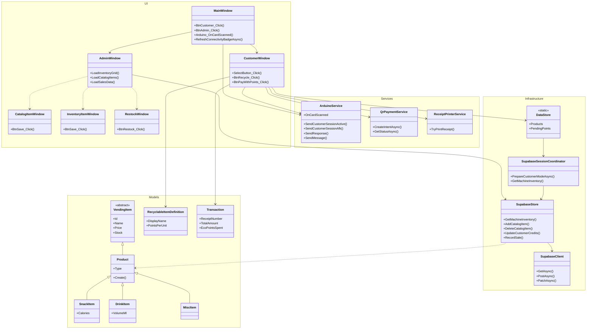

# Simplified Grouped Class Diagram

This version keeps only the core classes needed to understand the system at a high level.

## How to Explain It

- `UI` contains the main WPF screens the user sees.
- `Models` are the product, recycle, and receipt objects used at runtime.
- `Services` isolate hardware, QR payment, and receipt printing.
- `Infrastructure` is the Supabase-backed data path.
- `ArduinoService` owns the customer `STATE:ACTIVE` and main-screen `STATE:AFK` hardware commands shown in the README hardware GIFs.
- The app now uses Supabase directly; the old local database fallback path has been removed.
- Catalog delete lives in `SupabaseStore`: clear vending slots first, then soft-delete the catalog row for report-safe history.
