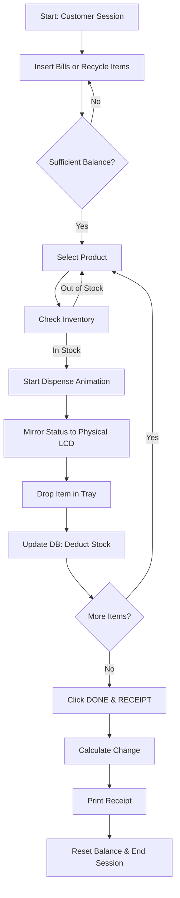

# Buying Process Flowchart

```mermaid
graph TD
    A[Start: Customer Session] --> B[Insert Bills or Recycle Items]
    B --> C{Sufficient Balance?}
    C -- No --> B
    C -- Yes --> D[Select Product]
    D --> E[Check Inventory]
    E -- In Stock --> F[Start Dispense Animation]
    E -- Out of Stock --> D
    F --> G[Mirror Status to Physical LCD]
    G --> H[Drop Item in Tray]
    H --> I[Update DB: Deduct Stock]
    I --> J{More Items?}
    J -- Yes --> D
    J -- No --> K[Click DONE & RECEIPT]
    K --> L[Calculate Change]
    L --> M[Print Receipt]
    M --> N[Reset Balance & End Session]
```
