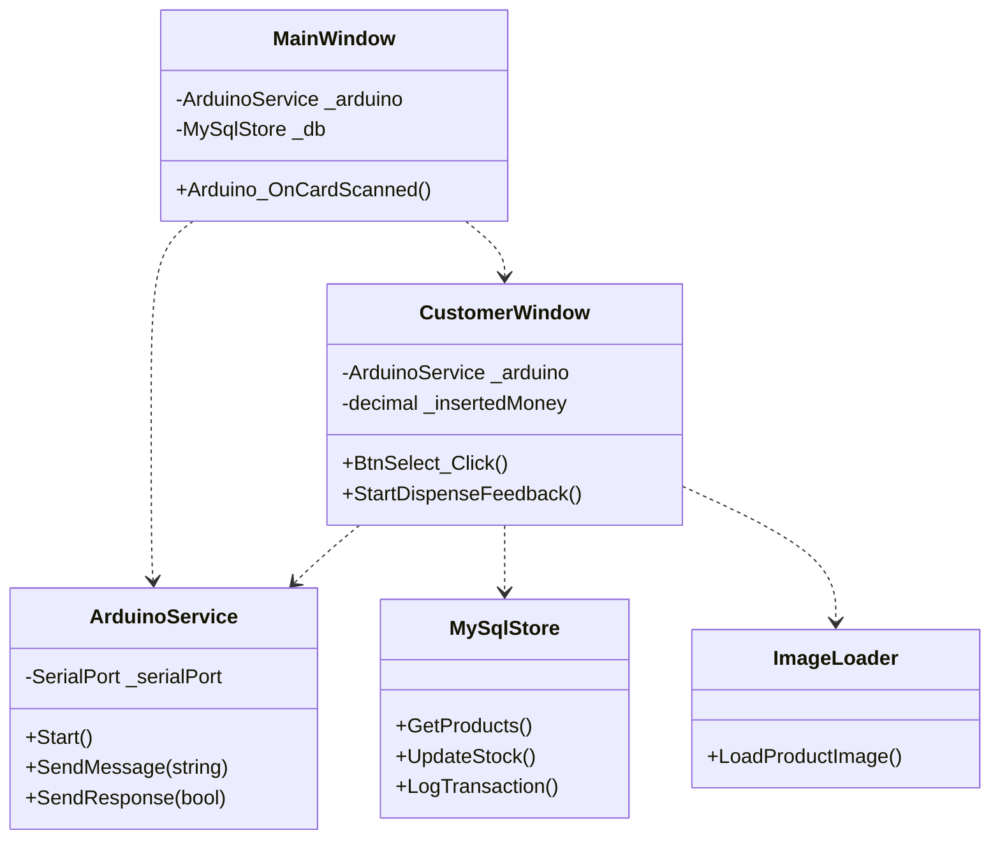

# System Class Diagram

```mermaid
classDiagram
    class MainWindow {
        -ArduinoService _arduino
        -MySqlStore _db
        +Arduino_OnCardScanned()
    }
    class CustomerWindow {
        -ArduinoService _arduino
        -decimal _insertedMoney
        +BtnSelect_Click()
        +StartDispenseFeedback()
    }
    class ArduinoService {
        -SerialPort _serialPort
        +Start()
        +SendMessage(string)
        +SendResponse(bool)
    }
    class MySqlStore {
        +GetProducts()
        +UpdateStock()
        +LogTransaction()
    }
    class ImageLoader {
        +LoadProductImage()
    }
    MainWindow ..> ArduinoService
    MainWindow ..> CustomerWindow
    CustomerWindow ..> ArduinoService
    CustomerWindow ..> MySqlStore
    CustomerWindow ..> ImageLoader
```
