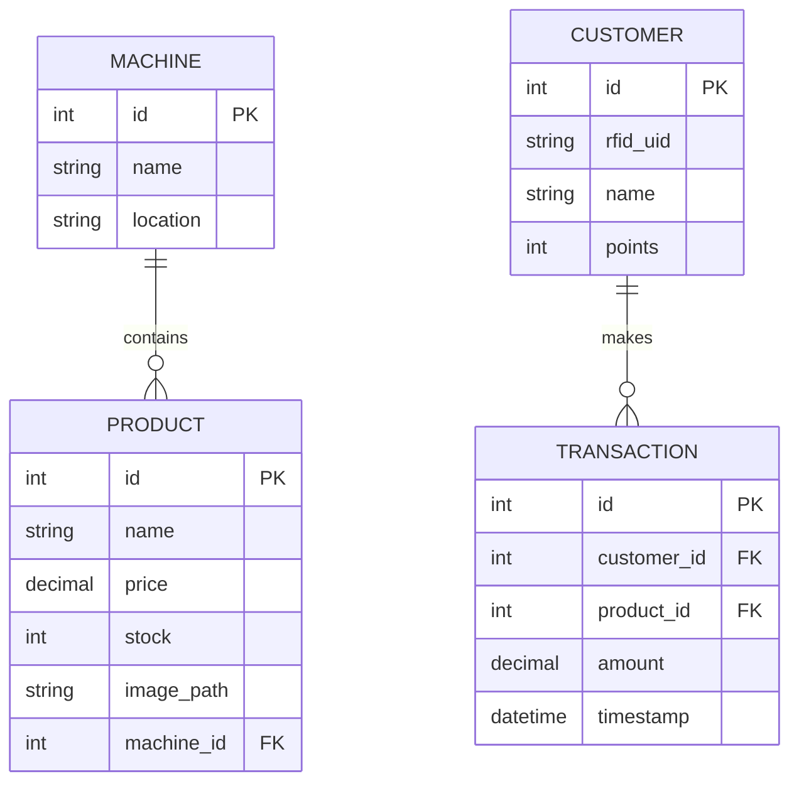

# Database Schema (EER Diagram)

```mermaid
erDiagram
    MACHINE ||--o{ PRODUCT : contains
    MACHINE {
        int id PK
        string name
        string location
    }
    PRODUCT {
        int id PK
        string name
        decimal price
        int stock
        string image_path
        int machine_id FK
    }
    CUSTOMER ||--o{ TRANSACTION : makes
    CUSTOMER {
        int id PK
        string rfid_uid
        string name
        int points
    }
    TRANSACTION {
        int id PK
        int customer_id FK
        int product_id FK
        decimal amount
        datetime timestamp
    }
```
