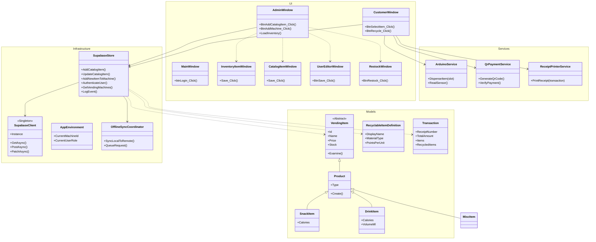

# Simplified Class Diagram v2

```mermaid
classDiagram
    %% Core Infrastructure
    namespace Infrastructure {
        class SupabaseStore {
            +AddCatalogItem()
            +UpdateCatalogItem()
            +AddNewItemToMachine()
            +AuthenticateUser()
            +GetVendingMachines()
            +LogEvent()
        }
        class SupabaseClient {
            <<Singleton>>
            +Instance
            +GetAsync()
            +PostAsync()
            +PatchAsync()
        }
        class AppEnvironment {
            +CurrentMachineId
            +CurrentUserRole
        }
        class OfflineSyncCoordinator {
            +SyncLocalToRemote()
            +QueueRequest()
        }
    }

    %% Models
    namespace Models {
        class VendingItem {
            <<Abstract>>
            +Id
            +Name
            +Price
            +Stock
            +Examine()
        }
        class Product {
            +Type
            +Create()
        }
        class SnackItem {
            +Calories
        }
        class DrinkItem {
            +Calories
            +VolumeMl
        }
        class RecyclableItemDefinition {
            +DisplayName
            +MaterialType
            +PointsPerUnit
        }
        class Transaction {
            +ReceiptNumber
            +TotalAmount
            +Items
            +RecycledItems
        }
    }

    %% UI / Windows
    namespace UI {
        class MainWindow {
            +btnLogin_Click()
        }
        class AdminWindow {
            +BtnAddCatalogItem_Click()
            +BtnAddMachine_Click()
            +LoadInventory()
        }
        class CustomerWindow {
            +BtnSelectItem_Click()
            +BtnRecycle_Click()
        }
        class InventoryItemWindow {
            +Save_Click()
        }
        class CatalogItemWindow {
            +Save_Click()
        }
        class UserEditorWindow {
            +BtnSave_Click()
        }
        class RestockWindow {
            +BtnRestock_Click()
        }
    }

    %% Services
    namespace Services {
        class ArduinoService {
            +DispenseItem(slot)
            +ReadSensor()
        }
        class QrPaymentService {
            +GenerateQrCode()
            +VerifyPayment()
        }
        class ReceiptPrinterService {
            +PrintReceipt(transaction)
        }
    }

    %% Relationships
    VendingItem <|-- Product
    Product <|-- SnackItem
    Product <|-- DrinkItem
    Product <|-- MiscItem
    
    AdminWindow --> SupabaseStore
    CustomerWindow --> SupabaseStore
    SupabaseStore --> SupabaseClient
    SupabaseStore --> OfflineSyncCoordinator
    
    CustomerWindow --> ArduinoService
    CustomerWindow --> QrPaymentService
    CustomerWindow --> ReceiptPrinterService
    
    AdminWindow ..> InventoryItemWindow
    AdminWindow ..> CatalogItemWindow
    AdminWindow ..> UserEditorWindow
    AdminWindow ..> RestockWindow
    
    SupabaseStore ..> VendingItem
    SupabaseStore ..> RecyclableItemDefinition
    SupabaseStore ..> Transaction
```
